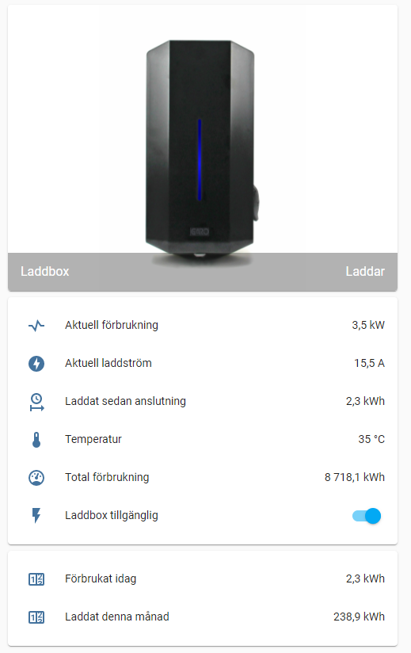

# Garo Chargebox in Home Assistant
Details for setting up Garo Chargebox in Homeassistant

I set up this integration purely with the rest and curl a long time back and thought i would share it with you.
Texts are in Swedish, i think you will figure it out :)

 

It is using the following parts:

* Command line switch to control availability on/off for the chargebox.. if you don't trust your neighbours then you can schedule or automate the availability of charging from the box.
* Rest sensor to collect the data from the box as attributes (one call to collect all stats)
* Template sensors to calculate and make the collected data representable and enumerate statuses.
* Lovelace cards with dynamic image that changes color based on status.
* Utility sensors that collect and calculate stats for usage per month and day..


*Note:* for chargebox with software version earlier than v1.3.1 you need to format the urls like this instead:
```
http://192.168.xxx.yyy:2222/rest/chargebox/mode
http://192.168.xxx.yyy:2222/rest/chargebox/status
```

Switch to control the state/availability for the box (update with your IP accordingly)

```
switch:
  - platform: command_line
    switches:
#Laddbox mode
      laddbox_mode:
          command_on: '/usr/bin/curl -X POST http://192.168.xxx.yyy:8080/servlet/rest/chargebox/mode/ALWAYS_ON'
          command_off: '/usr/bin/curl -X POST http://192.168.xxx.yyy:8080/servlet/rest/chargebox/mode/ALWAYS_OFF'
          command_state: '/usr/bin/curl -X GET http://192.168.xxx.yyy:8080/servlet/rest/chargebox/status'
          value_template: '{{ value_json.mode == "ALWAYS_ON" }}'
```

The sensor with attributes:

```
sensor:
  - platform: rest
    name: Laddbox
    resource: http://192.168.xxx.yyy:8080/servlet/rest/chargebox/status
    json_attributes:
        - connector
        - mode
        - currentLimit
        - pilotLevel
        - powerMode
        - currentChargingCurrent
        - currentChargingPower
        - accSessionEnergy
        - latestReading
        - currentTemperature
        - sessionStartValue
        - nrOfPhases
    value_template: '{{ value_json.connector }}'
```

Template sensors to calculate and enumerate statuses:
```
sensor:
  - platform: template
  #Laddbox templates
    sensors:
      laddbox_chargingcurrent:
        friendly_name: 'Aktuell laddström'
        value_template: '{{ states.sensor.laddbox.attributes["currentChargingCurrent"]/1000 | round(1)}}'
        unit_of_measurement: 'A'
      laddbox_chargingpower:
        friendly_name: 'Aktuell förbrukning'
        value_template: '{{ states.sensor.laddbox.attributes["currentChargingPower"]/1000 | round(1)}}'
        unit_of_measurement: 'kW'
      laddbox_sessionenergy:
        friendly_name: 'Laddat sedan anslutning'
        value_template: '{{ states.sensor.laddbox.attributes["accSessionEnergy"]/1000 | round(1)}}'
        unit_of_measurement: 'kWh'
      laddbox_totalconsumption:
        friendly_name: 'Total förbrukning'
        value_template: '{{ states.sensor.laddbox.attributes["latestReading"]/1000 | round(1)}}'
        unit_of_measurement: 'kWh'
      laddbox_temp:
        friendly_name: 'Laddbox temp'
        value_template: '{{ states.sensor.laddbox.attributes["currentTemperature"]}}'
        unit_of_measurement: '°C'
      laddbox_chargerstatus:
        friendly_name: 'Laddbox status'
        value_template: >
          
            Klar
          
            Avbruten
          
            Stoppad
          
            Ej ansluten
          
            Ansluten
          
            Ansluten - söker
          
            Laddar
          
            RCD-fel
          
            Överhettad
          
            Kritisk temperatur
          
            Initierar
          
            Kabelfel
          
            Låsfel
          
            Kontaktfel
          
            Ventileringsfel
          
            DC-fel
          
            Inaktiverad
          
            {{ state_attr('sensor.laddbox', 'connector') }}
          
```

Utility meters:
```
utility_meter:
  laddning_bil_manad:
    source: sensor.laddbox_totalconsumption
    cycle: monthly
  laddning_bil_daglig:
    source: sensor.laddbox_totalconsumption
    cycle: daily
```

Lovelace page:

```
- title: Car
    id: car
    icon: mdi:car
    panel: false
    cards:
      - type: vertical-stack
        cards:
          - type: picture-entity
            name: Laddbox
            entity: sensor.laddbox_chargerstatus
            state_image:
                "Klar": /local/laddbox_gron.png
                "Avbruten": /local/laddbox_gron.png
                "Stoppad": /local/laddbox_gron.png
                "Ej ansluten": /local/laddbox_gron.png
                "Ansluten": /local/laddbox_gron.png
                "Ansluten - söker": /local/laddbox_gron.png
                "Laddar": /local/laddbox_bla.png
                "RCD-fel": /local/laddbox_rod.png
                "Överhettad": /local/laddbox_rod.png
                "Kritisk temperatur": /local/laddbox_rod.png
                "Initierar": /local/laddbox_gron.png
                "Kabelfel": /local/laddbox_rod.png
                "Låsfel": /local/laddbox_rod.png
                "Kontaktfel": /local/laddbox_rod.png
                "Ventileringsfel": /local/laddbox_rod.png
                "DC-fel": /local/laddbox_rod.png
                "Inaktiverad": /local/laddbox_off.png
                "None": /local/laddbox_off.png
          - type: entities
            entities:
              - entity: sensor.laddbox_chargingpower
                name: Aktuell förbrukning
                icon: mdi:resistor
              - entity: sensor.laddbox_chargingcurrent
                name: Aktuell laddström
                icon: mdi:flash-circle
              - entity: sensor.laddbox_sessionenergy
                name: Laddat sedan anslutning
                icon: mdi:clock-start
              - entity: sensor.laddbox_temp
                name: Temperatur
                icon: mdi:thermometer
              - entity: sensor.laddbox_totalconsumption
                name: Total förbrukning
                icon: mdi:gauge
              - entity: switch.laddbox_mode
                name: Laddbox tillgänglig
          - type: entities
            entities:
              - entity: sensor.laddning_bil_daglig
                name: Förbrukat idag
              - entity: sensor.laddning_bil_manad
                name: Laddat denna månad
```
