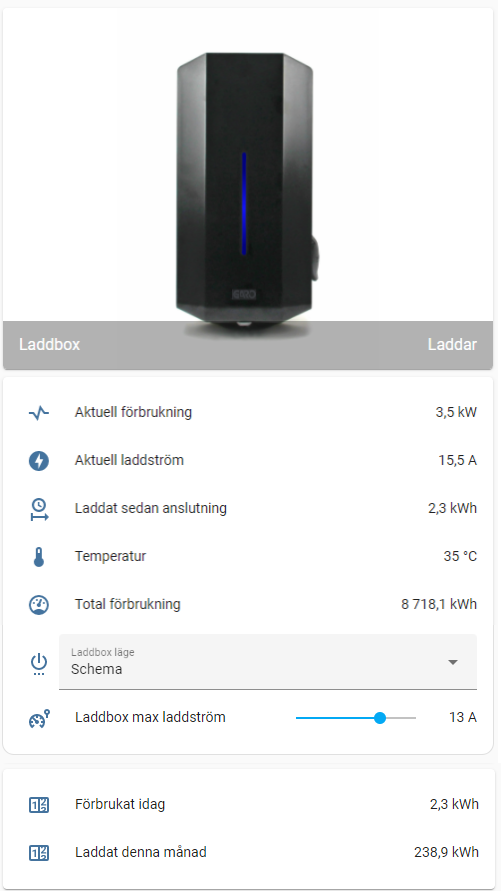

# Garo Chargebox in Home Assistant
An integration with Garo Chargebox without custom components.

Some texts are in Swedish, i think you will figure it out :)



It consists of the following parts:

* Command line switch to control availability on/off for the chargebox.. if you don't trust your neighbours then you can schedule or automate the availability of charging from the box.
* Rest sensor to collect the data from the box as attributes (one call to collect all stats)
* Template sensors to calculate and make the collected data representable and enumerate statuses.
* Lovelace cards with dynamic image that changes color based on status.
* Utility sensors that collect and calculate stats for usage per month and day..


### How to add to your Home Assistant:

1. Download and put `www` and `garo_chargebox` in to your home assistant `config` folder.  
2. Update the files `garo_chargebox/sensor.yaml` and `garo_chargebox/switch.yaml` with the ip or hostname of your chargebox.  
3. Add below in `configuration.yaml`:    
*__Note__: you can only have __one section of each main entry__, such as sensor, switch, utility_meter and template in your configuration.yaml so add the includes in to any existing integration type if you already have one of these sections in your file. However, child elements such as template.sensor need to be added even if it already exist.*

    ``` 
    template: 
      ### GARO CHARGEBOX ###
      sensor: 
        - include garo_chargebox/template_sensor.yaml

    utility_meter:
      ### GARO CHARGEBOX ###
      !include garo_chargebox/utility_meter.yaml

    sensor: 
      ### GARO CHARGEBOX ###
      - !include garo_chargebox/sensor.yaml

    switch:
      ### GARO CHARGEBOX ###
      - !include garo_chargebox/switch.yaml
    ```

4. Add the view or cards in to existing view in `ui-lovelace.yaml` if you are using Yaml mode:


    a) Add in views section (placement will determine order):
    ```
    views:
      - !include garo_chargebox/lovelace_view.yaml
    ```
    b) Or add the cards in existing view (example):
    ```
   - title: Car
     id: car
     icon: mdi:car
     panel: false
     cards:
       - !include garo_chargebox/lovelace_cards.yaml
    ```


  
*Note:* for chargebox with software version earlier than v1.3.1 you need to format the urls differently, update of the box is recommended:
```
http://192.168.xxx.yyy:2222/rest/chargebox/mode
http://192.168.xxx.yyy:2222/rest/chargebox/status
```
